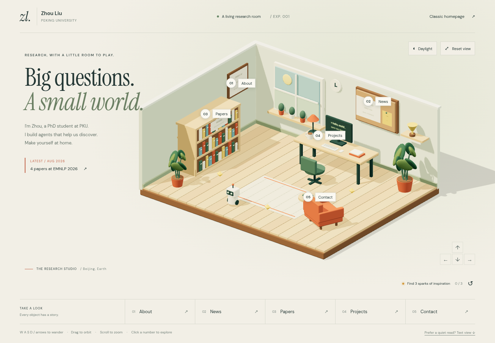

**Zhou's Research Room / 交互式科研工作室**

这是独立的 Astro + Three.js + WebGL 实验，不替换原来的 React 学术主页，也不修改简历。正式主页继续使用仓库根目录的 Vite 项目；实验的静态入口为 `/world/`。



[手机预览](preview/mobile.png) / [参考案例与技术调研](RESEARCH.md)

**这版可以做什么**

- 拖动旋转房间，滚轮缩放，一键复位镜头。
- 点击书架看论文、电脑看开源项目、公告板看 News、身份牌看介绍、聊天角看联系方式。
- 点击房间后，用 WASD / 方向键移动机器人；手机用方向按钮长按移动。
- 机器人不能穿过家具或房间边界，可以收集三个灵感光点并重新开始。
- 切换白天和傍晚灯光。
- 用底部导航直接打开所有内容，不需要完成游戏。
- 通过 Text view 看完整文字版；禁用 JavaScript、WebGL 不可用或上下文丢失时仍有文字内容。

论文、预印本、项目和 News 来自 `../src/content/profile.ts`、`../src/content/news.ts`，不会另抄一份科研记录。房间中装饰用的公告板文字和首页短讯是本次实验的固定文案；更新对应最新消息时应一起修改。

**本机启动**

专用 Conda 环境：`/mnt/bn/liuzhou-hl-training/liuzhou/conda_envs/homepage-research-world`，使用 Node.js 22。

在此 `world/` 目录运行：

```bash
conda activate /mnt/bn/liuzhou-hl-training/liuzhou/conda_envs/homepage-research-world
npm ci
npm run dev
```

开发入口：`http://localhost:4321/world/`。通过 SSH 连接这台机器时，需要转发对应端口，浏览器中的 localhost 才能访问远端服务。

```bash
npm test
npm run build
npm run preview -- --port 4322
```

生产构建预览：`http://localhost:4322/`，会自动跳转到 `/world/`；直接打开 `/world` 或 `/world/` 也可以。预览使用 Vite 的静态文件服务，避免 Astro 在根路径展示 base-path 404；构建仍由 Astro 完成。端口占用时会明确报错，不会悄悄换端口。

如果在远程服务器运行，浏览器中的 `127.0.0.1` 指的是你自己电脑。需要先把服务器的 `4322` 端口转发到本机，再打开上述地址。不要直接双击 `dist/index.html`，模块和字体需要 HTTP 服务及正确的 `/world/` 路径。

**GitHub Pages**

Astro 输出纯静态文件，Three.js 在访问者浏览器中渲染，不需要 GPU 服务器或 Node.js 后端。`astro.config.mjs` 已设置 `site` 和 `/world` base。

实验分支的 `Check Research World Experiment` 工作流会检查两个站点，并上传 `academic-homepage-with-world` 构建产物，**不会部署或覆盖正式网站**。它的产物结构为：

```text
dist/
  index.html       原学术主页
  assets/          原主页资源
  world/
    index.html     三维实验
    _astro/        三维脚本、样式和字体
```

确认效果之后，可以将该构建步骤接到现有 Pages 流程，使正式主页和 `/world/` 并存。GitHub Pages 没有每个分支自动独立预览的功能；当前仓库的 Pages 环境只允许 `main` 部署，本次没有修改该保护规则。

**实现位置**

- `src/pages/index.astro`：页面结构、导航和控件。
- `src/components/RoomContent.astro`：复用官网数据的静态正文。
- `src/scripts/app.ts`：内容弹窗、焦点恢复和文字降级。
- `src/scripts/room.ts`：代码生成的房间、家具、机器人和交互位置。
- `src/scripts/world.ts`：渲染、镜头、输入、灯光、资源清理和可见性暂停。
- `src/scripts/movement.ts`：移动与碰撞；对应 `tests/movement.test.ts`。
- `RESEARCH.md`：参考案例和 Three.js / 3DGS 路线对比。

**性能和边界**

- 不加载外部 3D 模型，不使用后处理或物理引擎；所有场景几何由代码生成。
- Three.js 通过动态 import 加载，正文不会等三维脚本加载完才出现。
- DPR 上限 1.5，阴影只在需要时更新；房间离开屏幕、页面切到后台时停止动画循环。
- 遵循 `prefers-reduced-motion`，减少装饰动画。移动和镜头仍响应主动操作。
- 这不是写实扫描场景，也不是第一人称大地图；当前是可旋转观察、可控制角色行走的单房间原型。
- 移动端已做浏览器尺寸检查，但尚未在真实 iOS / Android 设备上测帧率和功耗。
- Three.js 的压缩前构建分块超过 500 kB，构建器会提示体积警告。这不是构建失败，也不代表需要服务器端运行。

**浏览器检查环境**

本机无头 Chrome 的 GPU 初始化曾阻塞，连空白页截图都会超时。仅在测试进程中指定 Mesa/SwiftShader 后可以正常检查，不需要访客设置这些参数：

```bash
export VK_DRIVER_FILES=/opt/google/chrome/vk_swiftshader_icd.json
export VK_ICD_FILENAMES=/opt/google/chrome/vk_swiftshader_icd.json
export __EGL_VENDOR_LIBRARY_FILENAMES=/usr/share/glvnd/egl_vendor.d/50_mesa.json
```

本地浏览器连接使用 `--no-proxy-server`，npm CLI 使用缓存。检查截图放在工作树的 `output/playwright/`，不提交临时浏览器状态。

已通过：主站构建、根目录 ESLint、Astro 类型检查与静态构建、5 项移动测试；1440×1000 和 390×844 浏览器视觉检查；五个栏目弹窗、论文数量和链接、Esc 关闭与焦点恢复、镜头旋转、昼夜切换、机器人移动和光点收集、文字入口、禁用 JavaScript、禁用 WebGL 与模拟上下文丢失后的降级。尚未完成真实手机的性能测试。
